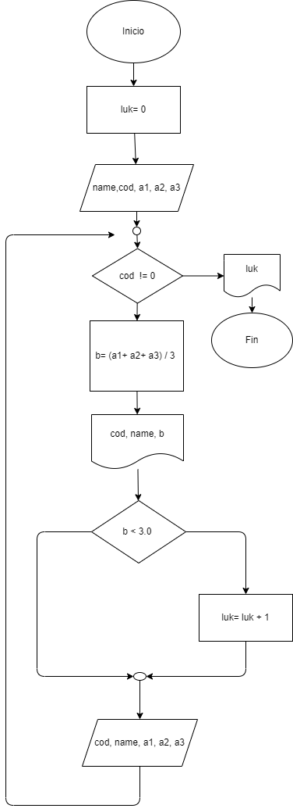

# Ejercicio 1

### Hacer el diargama de flujo y el diagrama en python que lea el código y nombre del estuadfiante y las notas de los 3 parciales de una materia y que calcule e imprima el código el nombre y la nota final de cada estudiante. :)
### No se sabe cuantos estudiantes, pero despues de la informacion del ultimo, se introduce cero en el campo correspondiente al código, de mopdo que sirva como **centinela**, para indicare cuando termina los datos de entrada, tambien se debe informar al final cuántos estudiantes perdieron la materia.

